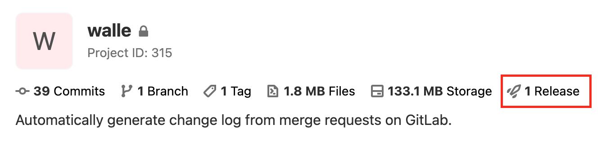

# Walle

`Walle` 是基于 GitLab MR (Merge Request) 自动生成 release notes 的工具。

## 介绍

通过 `walle help` 可以查看详细帮助文档。
`walle release` 子命令用于生成 release notes 并发布

```shell
$ walle help release

release a new version

Usage:
  walle release [flags]

Flags:
  -b, --branch stringArray   the target branch name of merge request
      --dry                  Print changelog only
  -h, --help                 help for release
  -m, --message string       The annotation of tag
      --ref string           Create tag using commit SHA, another tag name, or branch name (required)
  -t, --tag string           The name of a tag (required)

Global Flags:
      --host string      gitlab host address
  -p, --project string   project fully name or id
      --token string     gitlab token
```

其中全局参数可以从环境变量中读取，分别对应的环境变量名称如下：

```shell
export WALLE_GITLAB_HOST=https://code.bizseer.com  # --host https://code.bizseer.com
export WALLE_GITLAB_TOKEN=<your-gitlab-token>  # --token <your-gitlab-token>
export WALLE_PROJECT=liujie/walle  # --project liujie/walle
```

如发布 `v1.0.1` 版本，引用 master 分支最新提交。 使用从上一个 tag 到 `v1.0.1` 之间(如何不存在则到现在)合并到 `dev` 和 `master` 分支的 MR 标题，生成 release notes。

```shell
$ walle release --ref master -b dev -b master -t v1.0.1
successfully to release v1.0.1
```

会生成一个如下的 release 信息:

>
> _New Features:_
> - release: support update a release which already exists ([#4](https://code.bizseer.com/liujie/walle/-/merge_requests/4)) @liujie
> - version: add version command ([#3](https://code.bizseer.com/liujie/walle/-/merge_requests/3)) @liujie
> - 支持 release 命令创建 tag ([#1](https://code.bizseer.com/liujie/walle/-/merge_requests/1)) @liujie


可以在仓库的 release 页面查看相应的 release 信息 `https://code.bizseer.com/<project-path>/-/releases`



## 在 GitLab CI 自动运行

在 CI 环境可以使用构建好的 docker 镜像运行 `walle`，`docker.bizseer.com/bizseer/walle:<version>`

如在新增 `/^v[0-9]+\.[0-9]+\.[0-9]+$/i` 格式 tag 触发的流水线中，自动 release 的作业 `.gitlab-ci.yml` 配置如下：

```yaml
stage:
  - release

release:
  image: docker.bizseer.com/bizseer/walle:0.0.1
  stage: release
  variables:
    WALLE_GITLAB_TOKEN: <your-gitlab-token> 
  script:
    - walle version
    - export WALLE_GITLAB_HOST=$CI_SERVER_URL
    - walle release -p $CI_PROJECT_PATH --ref $CI_COMMIT_SHA -t $CI_BUILD_TAG
  only:
    - /^v[0-9]+\.[0-9]+\.[0-9]+$/i
  except:
    - branches
```

将变量中的 `<your-gitlab-token>` 替换为真实的 token (需要 `api`, `read_api`, `read_repository`, `write_repository` 权限)。

创建并推送 tag 来触发作业:

```shell
$ git tag v0.0.1 master
$ git push --tags
```

## Merge Request 标题格式

`walle` 使用 Merge Request 标题生成 release notes。遵循以下规则:

```
<type>(<scope>): <title content>
  │       │             │
  │       │             └─⫸ 标题
  │       │
  │       └─⫸ Change Scope: 不限定
  │
  └─⫸ Change Type: feat|fix|refactor|...
```

`walle` 根据不同的 type 生成不同类型的 release note，不在列表中的 type，不会被列入 release notes。

```
feat     -> `New Features`
fix      -> `Bug Fix`
refactor -> `Changes` 
```

生成 `release note` 格式为：

```
<scope>: <title content> (#MR-ID) `\@Author`
```

`scope` 可以为空。

## Changelog

详细请查看 [walle/releases](https://code.bizseer.com/liujie/walle/-/releases)
